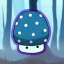

# About the project:

* ___"Mushrooms"___ is my own commercial project. The game was published on the Yandex platform.

* This ___economic clicker___ game was developed on the Unity platform and adapted for WebGl to run on desktop and mobile devices. 

* It contains many ___UI elements___ on which much attention has been paid when developing to provide the best UX and interesting mechanics of coin earning. 

* ___In-game purchases___ and advertisements are also built into the game, which requires user interaction and requests to the server. 

* For ___optimal display___ on each device special formats of UI elements location were developed. 

## Used plugins:

* Dotween
* TMP
* Yandex SDK

## How to play the game

>click on the mushroom __icon__ to go to the game link or click on this link: __clck.ru/344wyQ__

## System requirements:

The project requires the Unity Environment 2021.3.19f1 or higher to work with it.

## Project installation:

To install the project, download it from GitHub and open it in Unity. Then, open Loading scene and click on the "Play" button to start the project.

## Contribution to the project:

The project is open source, and we welcome contributions to its development. If you discover bugs or want to add new features, please submit a pull request to GitHub.

## Contacts:

If you have any questions or suggestions, please contact us through our GitHub or [Telegram](https://t.me/janitoor13).
